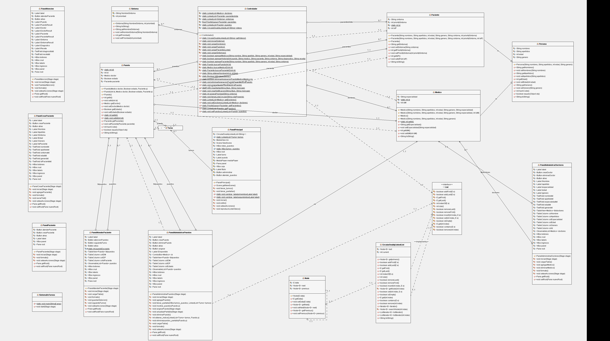

# Sistema-de-Turnos

## **Descripción:**

Proyecto correspondiente al primer parcial de la materia "Estructura de Datos", el proyecto
busca simular la atencion a pacientes dentro de un hospital en base a la prioridad 
de los sintomas del paciente.
## **Diagrama: **

## **Autores:**
_Isaac_Solis
_Alejandra_Quimi
_Rogwi_Cajas

## **Información:**

- El proyecto se desarrolla enteramente en JAVA (Open jdk 11 y Open java fx 11).
- Puede encontrar descripcion del funcionamiento del programa aqui[Reporte](Reporte-proyectoEstructurasP1.pdf)